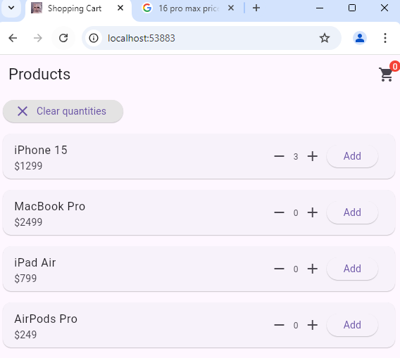
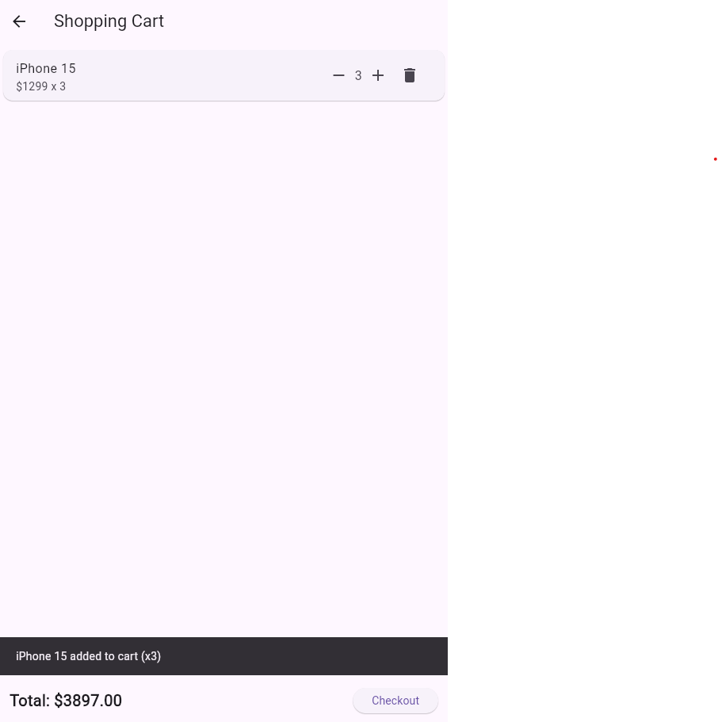

# Shopping Cart Flutter App

This is a simple shopping cart app built using **Flutter**. The app allows users to browse through a list of products, add them to their cart, and view their cart with quantities and total amounts.

---

## Features

- **Product List**: Display a list of products with their prices.
- **Add to Cart**: Users can add products to the cart with a customizable quantity.
- **Shopping Cart**: View added products in the cart with total quantities and prices.
- **Clear Quantities**: Reset all product quantities back to zero.
- **SnackBar Notifications**: Notify users when an item is added to the cart.

---

## Screenshots
_Example of the product list screen_



_Example of the cart screen_



---

## Getting Started

Follow the steps below to get this app running on your local machine.

### Prerequisites

Before you begin, make sure you have the following installed:

- [Flutter](https://flutter.dev/docs/get-started/install)
- [Dart](https://dart.dev/get-dart)
- A code editor (e.g., [Visual Studio Code](https://code.visualstudio.com/) or [Android Studio](https://developer.android.com/studio))

### Installation

1. Clone the repository:

   ```bash
   git clonehttps://github.com/thanachok11/shopping_cart_flutter.git
